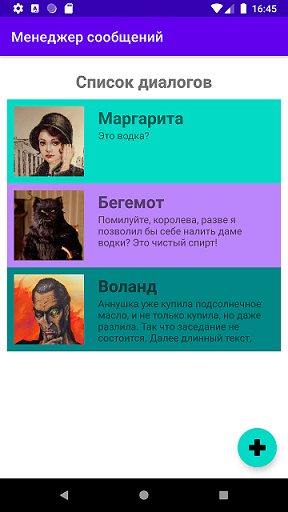

## практическое задание на курсе повышения квалификации "Разработка мобильных приложений для операционной системы Android на языке программирования JAVA" ДГТУ

### Задание:
Создать приложение – начальный экран менеджера сообщений, отображающее на экране 3 диалога, с тремя произвольными изображениями (аватарками), именами участников и текстами сообщений, как на рисунке 1. Локализовать на русский и английский языки надпись: «Список диалогов». Каждый диалог должен быть выделен разным цветом. Добавить кнопку «Создать» в правый нижний угол (кнопка ничего не делает).

Скриншот выполненного задания:
