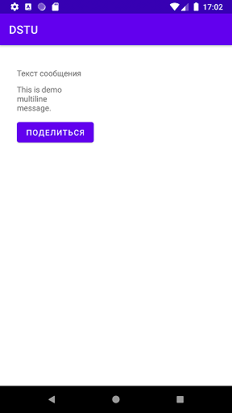

### Самостоятельное практическое задание "Использование интента"

#### Задание:
Создать приложение из двух активностей. Первая активность состоит из надписи, поля ввода и кнопки «Отправить». При клике на кнопку «Отправить» из первой активности, введенный текст сообщения должен выводиться во второй активности. Во второй активности реализовать неявный интент, путем добавления во вторую активность кнопку «Поделиться», которая предоставляет возможность выбора приложения (уже имеющегося на устройстве), поддерживающего обработку текста (например, gmail).

[Ссылка на github](https://github.com/averveiko/android/tree/main/DSTU/hw2)

Скриншоты выполненного задания:

Главное activity

При попытке отправить пустой текст

Второе activity

Поделиться

