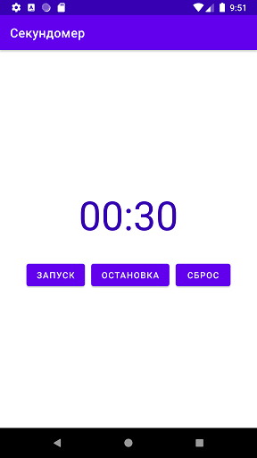

### Самостоятельное практическое задание "Жизненный цикл активности"

#### Задание:
Разработать приложение «Секундомер». Главная активность должна иметь элементы пользовательского интерфейса, отображающие время, а также функциональные элементы управления секундомером: запуск, остановка и сброс. Приложение должно корректно вести себя при смене ориентации устройства. Подсчет времени должен прекращаться при скрытии активности или потере фокуса и возобновляться при восстановлении фокуса.

[Ссылка на github](https://github.com/averveiko/android/tree/main/DSTU/hw3)

Скриншоты выполненного задания:

При повороте отсчет корректно продолжается:

Также корректно обрабатывается потеря и восстановление фокуса (onPause/onResume).
