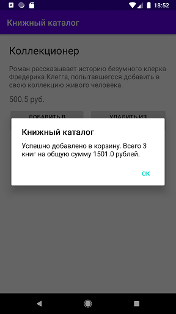
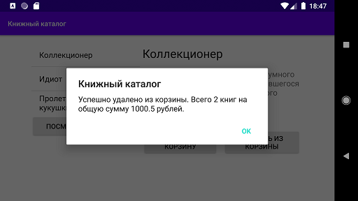

### Самостоятельное практическое задание "Фрагменты"

#### Задание:
Дополнить приложение «Книжный каталог» возможностью добавления книг в корзину. Корзина должна представлять из себя отдельный фрагмент в котором отображается информация о количестве книг и их общей стоимости. При просмотре деталей книги должна быть возможность добавления книги в корзину («Добавить в корзину») и удалении ее оттуда («Удалить из корзины»), если она уже была добавлена. Разместить на главной активности кнопку перехода к активности, отображающей фрагмент корзины («Посмотреть корзину»). Если главная активность находится в ландшафтной ориентации, при клике на кнопку «Посмотреть корзину» детальная информация о книге должна заменятся фрагментом «корзины».

[Ссылка на github](https://github.com/averveiko/android/tree/main/DSTU/hw4)

Скриншоты выполненного задания:

Главное activity

Просмотр детальной информации

Добавляем книгу в корзину

Просмотр корзины

Ландшафтная ориентация

Удаляем книгу из корзины

Просмотр корзины

