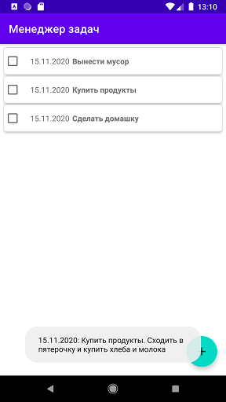
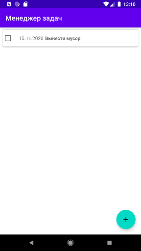

### Самостоятельное практическое задание "Использование RecycleView и CardView для отображения списков"

#### Задание:
Создать приложение «Менеджер задач», отображающее на экране список задач. Каждый элемент списка состоит из двух текстовых полей (название задачи и дата) и чекбокса. При снятии галочки в чекбоксе, задача должны быть удалена из списка. В нижний правый угол добавить кнопку «плюс» (Floating Action Button) – кнопка ничего не делает. При клике на элемент списка должно появляться сообщение (Toast) с полной информацией о задаче.

[Ссылка на github](https://github.com/averveiko/android/tree/main/DSTU/hw5)

Скриншоты выполненного задания:

Главное activity. При клике на задачу внизу появляется Toast с полной информацией о задаче

При установке check box'а задача удаляется из списка

