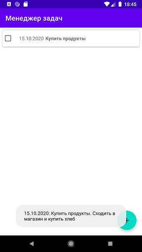
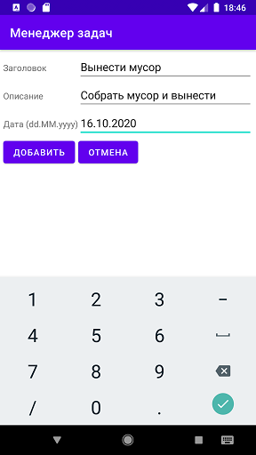
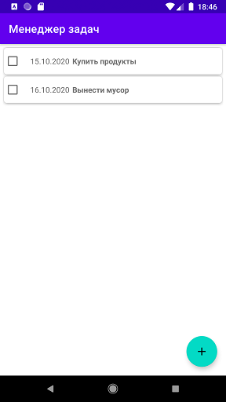
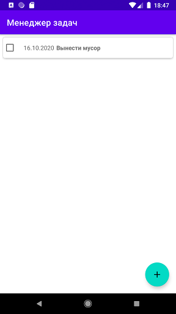

### Самостоятельное практическое задание "Хранение данных приложения в базе данных SqLite"

#### Задание:
Обновить приложение «Менеджер задач», из предыдущей лабораторной работы. Требуется сохранить данные о задачах в базе данных. При клике на кнопку «плюс» (Floating Action Button) должно открываться активити, используя которою можно добавить в базу данных новую задачу. При возращении на главную активность список задач должен содержать обновленные данные, для это можно использовать метод адаптера notifyDataSetChange().При снятии галочки в чекбоксе, задача должна быть удалена из списка и базы данных.

[Ссылка на github](https://github.com/averveiko/android/tree/main/DSTU/hw6)

Скриншоты выполненного задания:

Главное activity. При клике на задачу внизу появляется Toast с полной информацией о задаче

Экран добавления новой задачи

Задача добавлена, список обновлен

При установке check box'а задача удаляется из списка

